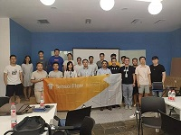
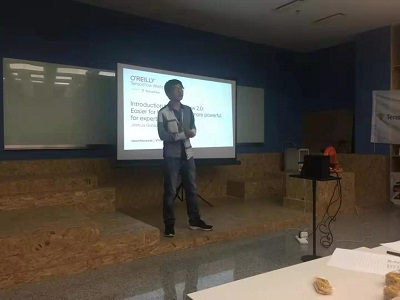
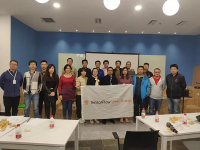

### Hi there 👋
# caiyongji: Not only a developer!

### [caiyongji.com](http://caiyongji.com)

Contents
-----------------

- [PERSONAL APPS](#PERSONAL-APPS)
- [TFUG](#TFUG)
  - [ML Articles](#ML-Articles)
- [ARTICLES](#ARTICLES)
- [ABOUT](http://caiyongji.com/#about)
- [CONTACT](http://caiyongji.com/#contact)
- [RESUME](http://caiyongji.com/resume/index.html)
- [BLOG](http://blog.caiyongji.com/)
- [我的公众号](#我的公众号)

# PERSONAL APPS #

[Quit Smoking with Cai(Flutter)【2020】](https://play.google.com/store/apps/details?id=com.caiyongji.quit_smoking)

[Quick Flashlight (Android)【2017】](https://play.google.com/store/apps/details?id=com.caiyongji.flashlight.quickflashlight)

[Cornershop - Wechat Shopping Program(full solution)【2016】](https://github.com/caiyongji/cornershop)

[Cookie Injector(Chrome Extension)【2016】](https://chrome.google.com/webstore/detail/cookie-injector/mflfghebbbnmdnkhbnmhajalhbgalklk)

# TFUG #

  
[「活动回顾 」TensorFlow Meetup 大连第一次活动回顾](https://mp.weixin.qq.com/s/XpvfGSTPjyFzKfgSbMsJGw)

  
[「活动回顾 」TensorFlow World Extended 大连第二次活动回顾](https://mp.weixin.qq.com/s/wzRgmwJcf34GubTKlFPNsg)

  
[[活动回顾]TF 2.x Best Bet（大连&成都）](https://mp.weixin.qq.com/s/nq2CpvqBstgVQfNo2gDYZQ)

## ML Articles ##

[机器学习导图系列（1）：数据处理](http://blog.caiyongji.com/2019/04/07/machine-learning-mid-map-1.html)  
[机器学习导图系列（2）：概念](http://blog.caiyongji.com/2019/04/08/machine-learning-mid-map-2.html)  
[机器学习导图系列（3）：过程](http://blog.caiyongji.com/2019/04/09/machine-learning-mid-map-3.html)  
[机器学习导图系列（4）：算法(含61公式)](http://blog.caiyongji.com/2019/04/10/machine-learning-mid-map-4.html)  
[机器学习导图系列（5）：机器学习模型及神经网络模型](http://blog.caiyongji.com/2019/04/11/machine-learning-mid-map-5.html)  

# ARTICLES #
[如何成为10倍速的程序员](http://blog.caiyongji.com/2017/12/20/how-to-be-10x-programmer.html)  
[在编程中为所欲为[圣诞版]](http://blog.caiyongji.com/2017/12/25/program-anything.html)  
[多域名解析及延伸知识点](http://blog.caiyongji.com/2018/01/04/domain-name-analysis.html)  
[冲顶大会APP技术选型及架构设计](http://blog.caiyongji.com/2018/01/04/chongdingdahui-tech-design.html)  
[AI时代：推荐引擎正在塑造人类](http://blog.caiyongji.com/2018/01/13/ai-era.html)  
[全栈技术导图](http://blog.caiyongji.com/2018/01/25/full-stack-mapping.html)  
[微信红包的随机算法是怎样实现的？](http://blog.caiyongji.com/2018/01/30/wechat-red-envelope-algorithmn-design.html)  
[实例：使用puppeteer headless方式抓取JS网页](http://blog.caiyongji.com/2018/05/09/puppeteer-headless-grap-web-pages.html)  
[百度，你拿什么和谷歌争？](http://blog.caiyongji.com/2018/08/08/how-can-baidu-fight-with-google.html)  
[那些10w+的公众号都在写什么？](http://blog.caiyongji.com/2018/08/14/what-does-wechat-official-account-writing.html)  
[驳 《驳 《驳 《停止学习框架》》》](http://blog.caiyongji.com/2018/12/21/refute-refute-refute-stop-learning-frameworks.html)  
[天下苦谷歌网盘久矣！](http://blog.caiyongji.com/2020/04/17/baidupan.html)  
[你的知识死角不能否定你的技术能力](http://blog.caiyongji.com/2018/05/27/your-knowledge-died-corner.html)  
[摩拜单车和ofo单车数据分析报告](http://blog.caiyongji.com/2017/12/21/shared-bike.html)  

# 我的公众号 #
## (subscribe me) ##
 

<!--
**caiyongji/caiyongji** is a ✨ _special_ ✨ repository because its `README.md` (this file) appears on your GitHub profile.

Here are some ideas to get you started:

- 🔭 I’m currently working on ...
- 🌱 I’m currently learning ...
- 👯 I’m looking to collaborate on ...
- 🤔 I’m looking for help with ...
- 💬 Ask me about ...
- 📫 How to reach me: ...
- 😄 Pronouns: ...
- ⚡ Fun fact: ...
-->
